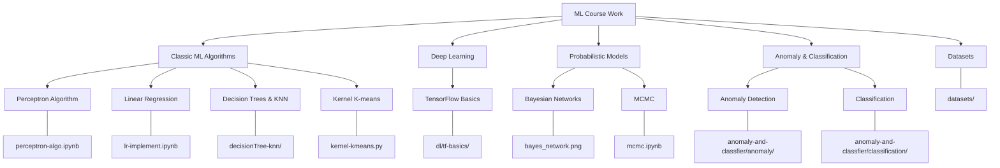

# Machine Learning Course Work

This repository contains implementations of various machine learning algorithms and techniques covered in a Machine Learning course. The implementations serve as practical exercises to understand theoretical concepts and apply them to real-world datasets.

## Repository Structure



## Algorithms Implemented

### Classic ML Algorithms

#### Perceptron Algorithm (`perceptron-algo.ipynb`)
- Implementation of the perceptron learning algorithm for binary classification
- Application to banknotes dataset with data preprocessing
- Cross-validation implementation and performance evaluation using F1 score

#### Linear Regression with Gradient Descent (`lr-implement.ipynb`)
- Implementation of gradient descent optimization algorithm
- Application to linear regression problems
- Comparison of normal gradient descent, mini-batch SGD, and SGD
- Analysis of batch size effects on convergence and speed

#### Kernel K-means Clustering (`kernel-kmeans.py`)
- Implementation of K-means clustering with kernels
- Implementation of K-means++ initialization for better cluster center selection
- Visualization of clustering results on 2D data

#### Decision Trees & KNN (`decisionTree-knn/`)
- Implementation of decision tree classifier
- Implementation of K-nearest neighbors algorithm
- Performance comparison between the two algorithms

### Probabilistic Models

#### Bayesian Networks
- Probability calculations with a medical diagnosis Bayesian network
- Joint and conditional probability computations

#### MCMC (`mcmc.ipynb`)
- Implementation of Markov Chain Monte Carlo methods
- Parameter estimation for probability distributions

### Anomaly Detection & Classification

#### Anomaly Detection (`anomaly-and-classfier/anomaly/`)
- Implementation of algorithms to detect anomalies in datasets
- Performance evaluation metrics for anomaly detection

#### Classification (`anomaly-and-classfier/classification/`)
- Implementation of various classification algorithms
- Evaluation and comparison of classification methods

## Datasets

The repository includes various datasets used for the implementations:
- Banknote authentication dataset
- Iris dataset
- Adult dataset
- Custom synthetic datasets for clustering demonstrations

## Getting Started

### Prerequisites
- Python 3.6+
- NumPy
- Pandas
- Matplotlib
- TensorFlow (for deep learning notebooks)

### Running the Notebooks
```bash
# Clone the repository
git clone <repository-url>

# Install requirements
pip install -r requirements.txt

# Run Jupyter notebooks
jupyter notebook
```

## License
This repository is licensed under the terms included in the LICENSE file.